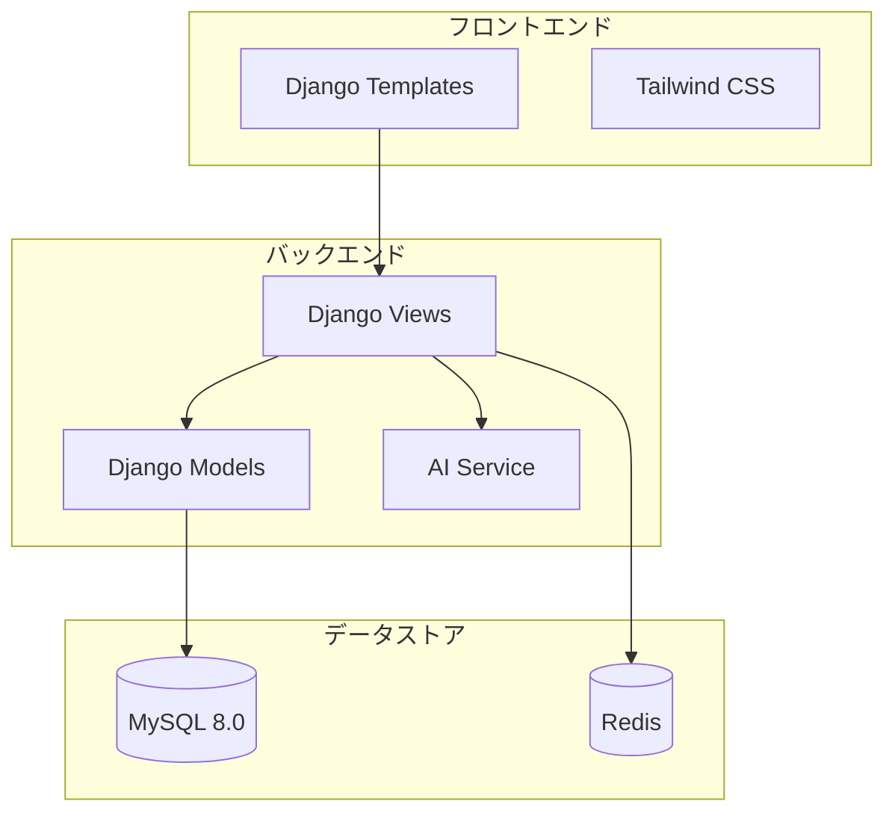

# AI回答管理システム基本設計書

## 改訂履歴

| バージョン | 日付 | 改訂内容 | 承認者 |
| --- | --- | --- | --- |
| 1.0 | 2024/12/20 | 初版作成 | - |

## 1. システムアーキテクチャ設計

### 1.1 開発体制と役割分担

```yaml
開発チーム構成:
  PM/テックリード: 1名
    - プロジェクト管理
    - アーキテクチャ設計
    - コードレビュー

  フロントエンド担当: 1名
    - テンプレート開発
    - UI/UXの実装
    - フロントエンド側の処理実装

  バックエンド担当: 1名
    - モデル設計・実装
    - ビジネスロジック実装
    - API連携実装

  インフラ担当: 1名
    - 環境構築・管理
    - デプロイメント管理
    - パフォーマンスチューニング

```

### 1.2 アプリケーション構成

```yaml
Djangoアプリケーション構成:
  accounts:
    - ユーザー認証・管理
    - APIキー管理

  questions:
    - 質問・回答管理
    - AI API連携

  core:
    - 共通機能
    - ユーティリティ

  templates:
    - ベーステンプレート
    - 共通コンポーネント

```

### 1.3 システム構成図



## 2. データベース設計

### 2.1 MySQL設定

```sql
-- 基本設定
SET GLOBAL innodb_buffer_pool_size = 1G;
SET GLOBAL character_set_server = utf8mb4;
SET GLOBAL collation_server = utf8mb4_unicode_ci;

-- 開発用ユーザー作成
CREATE USER 'ai_dev'@'%' IDENTIFIED BY 'dev_password';
GRANT ALL PRIVILEGES ON ai_response_db.* TO 'ai_dev'@'%';

```

### 2.2 主要テーブル定義

```sql
-- ユーザーテーブル
CREATE TABLE users (
    id BIGINT AUTO_INCREMENT PRIMARY KEY,
    username VARCHAR(150) NOT NULL UNIQUE,
    email VARCHAR(254) NOT NULL UNIQUE,
    password VARCHAR(255) NOT NULL,
    is_active BOOLEAN DEFAULT TRUE,
    created_at DATETIME DEFAULT CURRENT_TIMESTAMP,
    INDEX idx_username (username),
    INDEX idx_email (email)
) ENGINE=InnoDB;

-- 質問テーブル
CREATE TABLE questions (
    id BIGINT AUTO_INCREMENT PRIMARY KEY,
    user_id BIGINT NOT NULL,
    title VARCHAR(200) NOT NULL,
    content TEXT NOT NULL,
    status VARCHAR(20) NOT NULL,
    created_at DATETIME DEFAULT CURRENT_TIMESTAMP,
    FOREIGN KEY (user_id) REFERENCES users(id),
    INDEX idx_user_status (user_id, status),
    FULLTEXT INDEX ft_question (title, content)
) ENGINE=InnoDB;

-- 回答テーブル
CREATE TABLE responses (
    id BIGINT AUTO_INCREMENT PRIMARY KEY,
    question_id BIGINT NOT NULL,
    content TEXT NOT NULL,
    ai_source VARCHAR(20) NOT NULL,
    created_at DATETIME DEFAULT CURRENT_TIMESTAMP,
    FOREIGN KEY (question_id) REFERENCES questions(id),
    INDEX idx_question (question_id)
) ENGINE=InnoDB;

```

## 3. MVT実装設計

### 3.1 Models実装

```python
# accounts/models.py
class CustomUser(AbstractUser):
    class Meta:
        db_table = 'users'

    api_request_count = models.IntegerField(default=0)
    last_request_time = models.DateTimeField(null=True)

# questions/models.py
class Question(models.Model):
    class Meta:
        db_table = 'questions'

    user = models.ForeignKey(CustomUser, on_delete=models.CASCADE)
    title = models.CharField(max_length=200)
    content = models.TextField()
    status = models.CharField(max_length=20)
    created_at = models.DateTimeField(auto_now_add=True)

class Response(models.Model):
    class Meta:
        db_table = 'responses'

    question = models.ForeignKey(Question, on_delete=models.CASCADE)
    content = models.TextField()
    ai_source = models.CharField(max_length=20)
    created_at = models.DateTimeField(auto_now_add=True)

```

### 3.2 Views実装

```python
# questions/views.py
class QuestionCreateView(LoginRequiredMixin, CreateView):
    model = Question
    form_class = QuestionForm
    template_name = 'questions/create.html'

    def form_valid(self, form):
        form.instance.user = self.request.user
        response = super().form_valid(form)
        # AI回答生成の非同期タスク開始
        generate_ai_response.delay(self.object.id)
        return response

class QuestionDetailView(LoginRequiredMixin, DetailView):
    model = Question
    template_name = 'questions/detail.html'

    def get_context_data(self, **kwargs):
        context = super().get_context_data(**kwargs)
        context['responses'] = self.object.response_set.all()
        return context

```

### 3.3 Templates実装

```html
<!-- templates/base.html -->
<!DOCTYPE html>
<html>
<head>
    <meta charset="utf-8">
    <title>AI回答管理システム</title>
    
</head>
<body class="bg-gray-100">
    <nav class="bg-white shadow">
        <!-- ナビゲーションの実装 -->
    </nav>

    <main class="container mx-auto px-4 py-8">
        
    </main>
</body>
</html>

<!-- templates/questions/detail.html -->



<div class="bg-white rounded-lg shadow p-6">
    <h1 class="text-2xl font-bold mb-4">{{ question.title }}</h1>
    <div class="markdown-body">
        {{ question.content|markdown }}
    </div>

    
    <div class="mt-4 p-4 border rounded">
        <h2 class="font-bold">{{ response.ai_source }}</h2>
        <div class="markdown-body">
            {{ response.content|markdown }}
        </div>
    </div>
    
</div>


```

## 4. セキュリティ実装

### 4.1 認証・認可設定

```python
# settings.py
MIDDLEWARE = [
    'django.middleware.security.SecurityMiddleware',
    'django.contrib.sessions.middleware.SessionMiddleware',
    'django.middleware.csrf.CsrfViewMiddleware',
    'django.contrib.auth.middleware.AuthenticationMiddleware',
]

# セキュリティ設定
SECURE_BROWSER_XSS_FILTER = True
SECURE_CONTENT_TYPE_NOSNIFF = True
X_FRAME_OPTIONS = 'DENY'
CSRF_COOKIE_SECURE = True
SESSION_COOKIE_SECURE = True

```

### 4.2 API Key管理実装

```python
# core/crypto.py
from cryptography.fernet import Fernet

class APIKeyEncryption:
    def __init__(self):
        self.key = settings.ENCRYPTION_KEY
        self.cipher_suite = Fernet(self.key)

    def encrypt(self, api_key: str) -> str:
        return self.cipher_suite.encrypt(api_key.encode()).decode()

    def decrypt(self, encrypted_key: str) -> str:
        return self.cipher_suite.decrypt(encrypted_key.encode()).decode()

```

## 5. AI API連携実装

### 5.1 AI Service実装

```python
# questions/services.py
class AIService:
    def __init__(self):
        self.claude_client = ClaudeClient()
        self.chatgpt_client = ChatGPTClient()

    async def generate_response(self, question: str) -> dict:
        # Claude回答の生成
        claude_response = await self.claude_client.generate(question)

        # ChatGPT検証
        chatgpt_response = await self.chatgpt_client.verify(
            question, claude_response
        )

        # 最終検証
        final_response = await self.claude_client.verify(
            question, claude_response, chatgpt_response
        )

        return {
            'claude': claude_response,
            'chatgpt': chatgpt_response,
            'final': final_response
        }

```

### 5.2 非同期タスク実装

```python
# questions/tasks.py
@shared_task
def generate_ai_response(question_id: int):
    question = Question.objects.get(id=question_id)
    service = AIService()

    try:
        responses = service.generate_response(question.content)

        for ai_source, content in responses.items():
            Response.objects.create(
                question=question,
                content=content,
                ai_source=ai_source
            )

        question.status = 'completed'
        question.save()

    except Exception as e:
        question.status = 'error'
        question.save()
        logger.error(f"AI response generation failed: {str(e)}")

```

## 6. 開発環境構築

### 6.1 Docker設定

```yaml
# docker-compose.yml
version: '3.8'

services:
  web:
    build: .
    command: python manage.py runserver 0.0.0.0:8000
    volumes:
      - .:/app
    ports:
      - "8000:8000"
    depends_on:
      - db
      - redis

  db:
    image: mysql:8.0
    environment:
      MYSQL_DATABASE: ai_response_db
      MYSQL_USER: ai_dev
      MYSQL_PASSWORD: dev_password
      MYSQL_ROOT_PASSWORD: root_password
    volumes:
      - mysql_data:/var/lib/mysql
    ports:
      - "3306:3306"

  redis:
    image: redis:7.0
    ports:
      - "6379:6379"

volumes:
  mysql_data:

```

### 6.2 開発フロー管理

```yaml
開発フロー:
  1. 機能開発:
    - featureブランチの作成
    - ローカル環境での開発
    - テストの作成・実行
    - PRの作成

  2. コードレビュー:
    - チーム内レビュー
    - 修正対応
    - 承認・マージ

  3. デプロイ:
    - developブランチへのマージ
    - 開発環境での動作確認
    - 本番環境へのデプロイ

```

## 7. テスト戦略

### 7.1 テスト実装

```python
# questions/tests/test_views.py
class QuestionViewTests(TestCase):
    def setUp(self):
        self.user = CustomUser.objects.create_user(
            username='testuser',
            password='testpass'
        )
        self.client.login(username='testuser', password='testpass')

    def test_question_create(self):
        response = self.client.post(reverse('question_create'), {
            'title': 'Test Question',
            'content': 'Test Content'
        })
        self.assertEqual(response.status_code, 302)
        self.assertTrue(Question.objects.exists())

# questions/tests/test_services.py
class AIServiceTests(TestCase):
    @patch('questions.services.ClaudeClient')
    @patch('questions.services.ChatGPTClient')
    def test_generate_response(self, mock_chatgpt, mock_claude):
        service = AIService()
        response = service.generate_response('test question')
        self.assertIn('claude', response)
        self.assertIn('chatgpt', response)

```